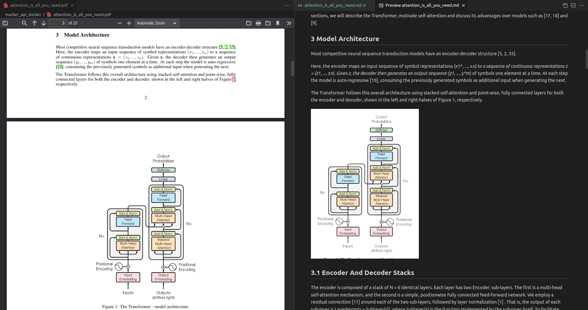

# Marker-api docker

Dockerization of the [marker-api repo](https://github.com/adithya-s-k/marker-api) to convert a PDF to markdown.



 * Github: [marker-api](https://github.com/adithya-s-k/marker-api)

## Requisites

[Docker](https://docs.docker.com/desktop/) and [nvidia container toolkit](https://docs.nvidia.com/datacenter/cloud-native/container-toolkit/latest/install-guide.html) must be installed.

## Docker image

### Download the image from the Docker Hub

You can download the image by

```bash
docker pull maximofn/marker_api:latest
```

### Build the image

Or you can build the image by

```bash
./build_docker_image.sh
```

## Usage

### Run the container

First you should run the container by

```bash
./run_app.sh
```

This up a container with the marker-api running on the port 8000. You must to wait until the message `INFO:     Uvicorn running on http://127.0.0.1:8000 (Press CTRL+C to quit)` appears.

### Convert a PDF to markdown

To convert a PDF to markdown you can use the following command

```bash
python pdf2markdown.py --pdf_file_path <path_to_pdf>
```

The markdown file will be saved into a folder in the same directory of the PDF file.
